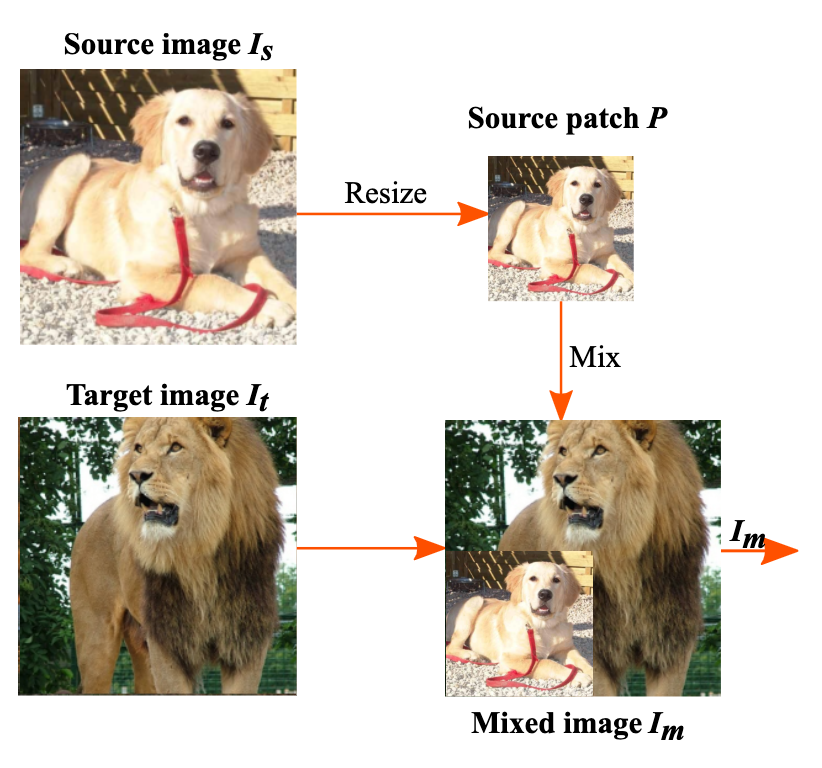

# ResizeMix: Mixing Data with Preserved Object Information and True Labels
Implementation of ResizeMix. Our implementation is based on repository: [dali-pytorch](https://github.com/JaminFong/dali-pytorch).

## Abstract
Data augmentation is a powerful technique to increase the diversity of data, which can effectively improve the generalization ability of neural networks in image recognition tasks. Recent data mixing based augmentation strategies have achieved great success. Especially, CutMix uses a simple but effective method to improve the classifiers by randomly cropping a patch from one image and pasting it on another image. To further promote the performance of CutMix, a series of works explore to use the saliency information of the image to guide the mixing. We systematically study the importance of the saliency information for mixing data, and find that the saliency information is not so necessary for promoting the augmentation performance. Furthermore, we find that the cutting based data mixing methods carry two problems of object information missing and label misallocation, which cannot be resolved simultaneously. We propose a more effective but very easily implemented method, namely ResizeMix. We mix the data by directly resizing the source image to a small patch and paste it on another image. The obtained patch preserves more substantial object information compared with conventional cut-based methods. ResizeMix shows evident advantages over CutMix and saliency-guided methods on both image classification and object detection tasks without additional computation cost, which even outperforms most costly search-based automatic augmentation methods.

## Method
<div>
	
</div>


## Requirements

* python >= 3.7.0
* pytorch >= 1.6.0
* CUDA >= 10.0
* nvidia-dali-cuda100 >= 0.23.0
* mmcv >= 1.0.5
* kornia >= 0.4.0
* mxnet >= 1.6.0 (only used for preparing the dataset)

## Train
1. Please prepare the ImageNet dataset as `.rec` following ["Create a Dataset Using RecordIO"](https://mxnet.apache.org/api/faq/recordio). The CIFAR-10 and CIFAR-100 datasets are not need this step.

2. Train with the following script. 
```
sh ./scripts/train_dist.sh 
```

## Results

CIFAR-10 dataset:

| Method       | AddCost | WRS28-10 | SS-2X96d |
| ------------ | ------- | -------- | -------- |
| Baseline     | ×       | 96.13    | 97.14    |
| AA           | √       | 97.32    | 98.00    |
| Fast AA      | √       | 97.30    | 98.00    |
| PBA          | √       | 97.42    | 97.97    |
| OHL-AA       | √       | 97.39    | -        |
| RA           | ×       | 97.30    | 98.00    |
| Faster AA    | √       | 97.40    | 98.00    |
| DADA         | √       | 97.30    | 98.00    |
| Cutout       | ×       | 96.90    | 97.14    |
| CutMix       | ×       | 97.10    | 97.62    |
| SaliencyMixx | √       | 97.24    | -        |
| ResizeMix    | ×       | 97.60    | 97.93    |
| ResizeMix+   | √       | 97.10    | 98.47    |

CIFAR-100 dataset:

| Method       | AddCost | WRS28-10 | SS-2X96d |
| ------------ | ------- | -------- | -------- |
| Baseline     | ×       | 81.20    | 82.95    |
| AA           | √       | 82.91    | 85.72    |
| Fast AA      | √       | 82.70    | 85.40    |
| PBA          | √       | 83.27    | 84.69    |
| RA           | ×       | 83.30    | -        |
| Faster AA    | √       | 82.20    | 84.40    |
| DADA         | √       | 82.50    | 84.70    |
| Cutout       | ×       | 81.59    | 84.0     |
| CutMix       | ×       | 83.40    | 85.0     |
| SaliencyMixx | √       | 83.44    | -        |
| Puzzle Mix   | √       | 84.05    | -        |
| ResizeMix    | ×       | 84.31    | 85.26    |
| ResizeMix+   | √       | 85.23    | 85.60    |

ImageNet dataset:

| Method       | AddCost | ResNet-50 | ResNet-101 |
| ------------ | ------- | --------- | ---------- |
| Baseline     | ×       | 76.31     | 78.13      |
| AA           | √       | 77.63     | -          |
| Fast AA      | √       | 77.60     | -          |
| OHL-AA       | √       | 78.93     | -          |
| RA           | ×       | 77.60     | -          |
| Faster AA    | √       | 76.50     | -          |
| DADA         | √       | 77.50     | -          |
| CutMix       | ×       | 78.60     | 79.83      |
| SaliencyMixx | √       | 78.74     | 79.91      |
| Puzzle Mix   | √       | 78.76     | -          |
| ResizeMix    | ×       | 79.00     | 80.54      |

## Model Weight
The pre-trained weight can be find in [models](https://drive.google.com/file/d/1mCfiEMDVSH3fYRrCLwfOdaX5e9du9mok/view?usp=share_link).

## Citation

If you find this repository/work helpful in your research, welcome to cite it.

```
@article{qin2020resizemix,
  title={ResizeMix: Mixing Data with Preserved Object Information and True Labels},
  author={Qin, Jie and Fang, Jiemin and Zhang, Qian and Liu, Wenyu and Wang, Xingang and Wang, Xinggang},
  journal={arXiv preprint arXiv:2012.11101},
  year={2020}
}
```

